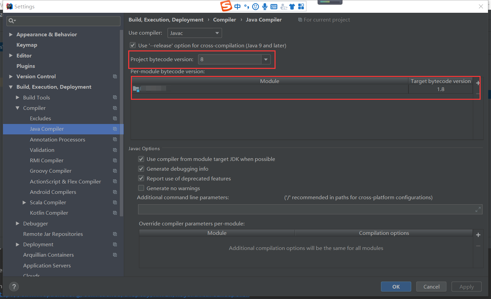
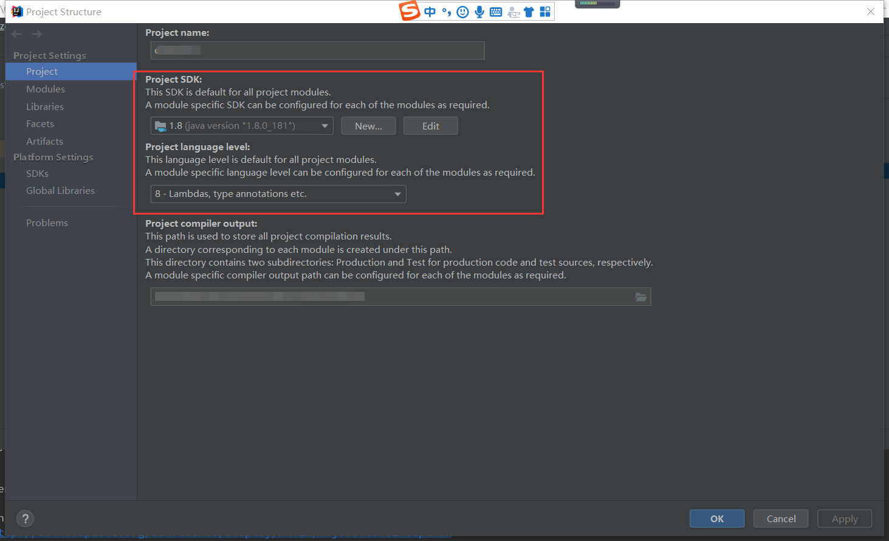
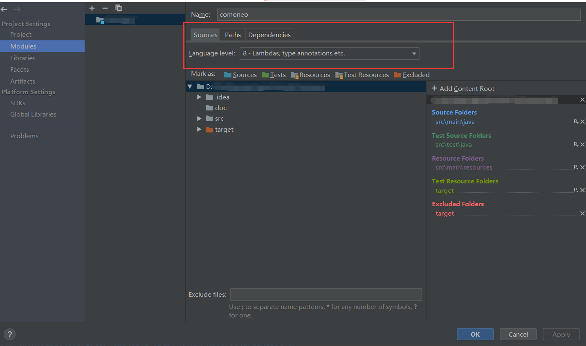

**1.常规办法**

在File->Setting中设置如下：



然后检查：File->Project Structure里面的相关配置：





以上办法能解决问题的概率在90%，如果还不行，那么请按照以下方法，基本上100%可以解决。

**2.非常规办法**

在File->Setting->Build->Build Tools->Maven下找到你的maven的配置文件地址，然后打开配置文件，检查配置文件中是否设置了全局jdk版本，如没有，则设置如下：

或者在maven安装目录下找到settings.xml文件，地址一般在：C:\Program Files\JetBrains\IntelliJ IDEA \*\*\*\*\*\*\*\plugins\maven\lib\maven3\conf

```
<profiles>
  <profile>
            <id>jdk1.8</id>
            <activation>
                <activeByDefault>true</activeByDefault>
                <jdk>1.8</jdk>
            </activation>
            <properties>
                <project.build.sourceEncoding>UTF-8</project.build.sourceEncoding>
                <maven.compiler.source>1.8</maven.compiler.source>
                <maven.compiler.target>1.8</maven.compiler.target>
                <maven.compiler.compilerVersion>1.8</maven.compiler.compilerVersion>
            </properties>
        </profile>
</profiles>
```


设置完成后保存，然后在idea里面重新打包即可。

---
> 参考链接：[https://www.cnblogs.com/jizhong/p/14814516.html](https://www.cnblogs.com/jizhong/p/14814516.html)
