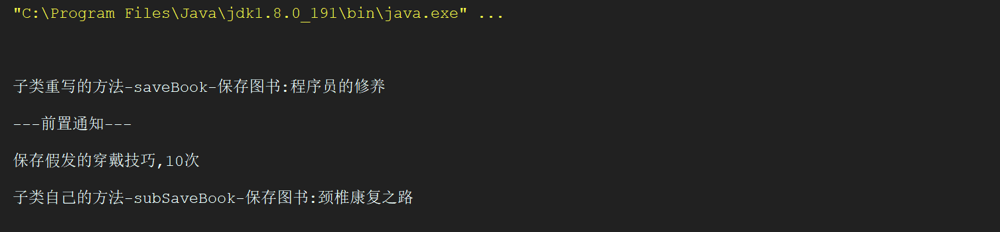

**戴着假发的程序员**出品  抖音ID：**戴着假发的程序员**欢迎关注

[[查看视频教程](https://www.bilibili.com/video/BV1Za411w7Lk/?p=15)]

限制匹配到具有给定 annotation 的类型中的连接点(使用 Spring AOP 时执行在具有给定 annotation 的类型中声明的方法)。

官方给出的案例：

任何连接点(仅在 Spring AOP 中执行方法)，其中目标 object 的声明类型具有`@Transactional`annotation：

```
@within(org.springframework.transaction.annotation.Transactional)
```


关于@within注解我们这里只做一个说明，因为@within和@target只有一点不同，其他都一样。

我们知道@target只对指定的当前类生效，也就是说指定的注解配置在当前类上才生效，其他的情况：配置再其接口，方法都不生效，并且子类中的任何方法也不会生效。

@within和@target的区别在于@within会对子类继承的方法生效，但是子类的其他方法或者子类重写了父类的方法就不会在生效。

看看这样的例子：

我们BooService类，BookService上有指定的注解，有两个方法。

```
1 /**
 2  * @author 戴着假发的程序员
 3  * 
 4  * @description
 5  */
 6 @Component
 7 @DkAnnotation
 8 public class BookService{
 9     public void saveBook(String title){
10         System.out.println("保存图书:"+title);
11     }
12     public void saveBook(String title,int count){
13         System.out.println("保存"+title+","+count+"次");
14     }
15 }
```


添加一个子类SubBookService，重写父类的其中一个方法，并且添加一个自己的方法：

注意子类不添加指定的注解

```
1 /**
 2  * @author 戴着假发的程序员
 3  * 
 4  * @description
 5  */
 6 @Component
 7 public class SubBookService extends BookService {
 8     @Override
 9     public void saveBook(String title){
10         System.out.println("子类重写的方法-saveBook-保存图书:"+title);
11     }
12     public void subSaveBook(String title){
13         System.out.println("子类自己的方法-subSaveBook-保存图书:"+title);
14     }
15 }
```


修改Aspect类，修改配置：

```
1 /**
 2  * @author 戴着假发的程序员
 3  * 
 4  * @description
 5  */
 6 @Component //将当前bean交给spring管理
 7 @Aspect //定义为一个AspectBean
 8 public class DkAspect {
 9     //使用@within配置匹配所有还有指定注解的方法
10     @Pointcut("@within(com.st.dk.demo7.annotations.DkAnnotation)")
11     private void pointCut1(){}
12     //定义一个前置通知
13     @Before("pointCut1()")
14     private static void befor(){
15         System.out.println("---前置通知---");
16     }
17 }
```


测试：

```
1 @Test
2 public void testAopPoint_within(){
3     ApplicationContext ac =
4             new AnnotationConfigApplicationContext(Appconfig.class);
5     SubBookService bean = ac.getBean(SubBookService.class);
6     bean.saveBook("程序员的修养");
7     bean.saveBook("假发的穿戴技巧",10);
8     bean.subSaveBook("颈椎康复之路");
9 }
```




我们会发现只有继承自父类的方法被匹配增强了，其他的重写和自己定义的方法都没有匹配。

---
> 参考链接：[https://www.cnblogs.com/jiafa/p/13835937.html](https://www.cnblogs.com/jiafa/p/13835937.html)
