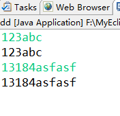
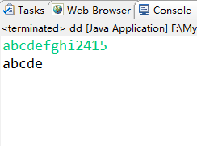

介绍一下Java里简单常用的输入输出方法。

Java的输出函数很简单，直接调用System类的out对象的print函数即可。

代码：

```
System.out.print(a);//输出变量a的值
System.out.print("214214");//输出字符串
System.out.print("123"+a);//混合输出字符串和变量值
/*
当然也可以使用System.out.println();表示换行输出，相当于System.out.print("\n");
　　其中System是一个类，out是java.io.PrintStream的对象，也就是System这个类中含有java.io.PrintStream的对象out。
　　print()是java.io.PrintStream类里的一个方法，也就是out对象的一个方法。
*/
```


Java的输入比较麻烦，找了好多书都讲的不详细，网上也看了些方法，像BufferedReader类和InputStreamReader类法，Scanner类法等等。综合发现还是Scanner类最好用，它既可以读字符，也可以读字符串和整数。

代码：

```
import java.util.Scanner;
public static void main(String [] args) { 
         Scanner sc = new Scanner(System.in); 
         System.out.println("请输入你的姓名："); 
         String name = sc.nextLine(); 
         System.out.println("请输入你的年龄："); 
         int age = sc.nextInt(); 
         System.out.println("请输入你的工资："); 
         float salary = sc.nextFloat(); 
         System.out.println("你的信息如下："); 
         System.out.println("姓名："+name+"\n"+"年龄："+age+"\n"+"工资："+salary); 
}
```


另外，该对象的next()方法和nextLine()方法的区别：

在java中，next()方法是不接收空格的，在接收到有效数据前，所有的空格或者tab键等输入被忽略，若有有效数据，则遇到这些键退出。nextLine()可以接收空格或者tab键，其输入应该以enter键结束。

在学习Java的输入时，有个有趣的发现，感兴趣的朋友可以往下看。

**Java版的getchar()函数：**(char)System.in.read()

　　当时想的是，既然输出用的是out对象，那么必然有个in对象的方法能完成输入的功能。于是就发现了System.in.read()这个东东，它实现的功能是：从键盘读一个字符。好嘛^\_^，那么就输下这个东东

```
System.out.println(System.in.read());
```


运行结果：


结果很意外，输入5，输出53 13 10；输入a，输出97 13 10；什么也不输直接回车，输出13 10。即输出了输入字符、回车控制字符和换行控制字符的ASCLL码！！

不，我不要ASCLL码数字，我要字符型！那么就强转一下吧。改下代码：

```
System.out.println((char)System.in.read());
```


果然如愿输出了字符型，而且回车控制字符和换行控制字符都不见了！而且经测试，结果完全符合算法题中的输入的要求，即在Java中实现了类似C++中的getchar()函数：**(char)System.in.read()**

再进一步思考，加个while(true)能否用字符数组形式输出字符串呢？

代码如下：

```
import java.io.IOException;
public class dd {
    public static void main(String[] args) throws IOException {
        while(true){
        System.out.print((char)System.in.read());
        }
    }
}
```


运行结果：



成功得到了字符串是不是？

实际并没有。。

这个方法有极大的缺陷：

```
System.out.println((char)System.in.read());
```


实际就相当于：

```
InputStream a=System.in;
char ch=(char)a.read();
System.out.print(ch);
```


果然还是没有摆脱缓冲区的束缚，把刚才输出字符串的代码的while(true)换成for循环：

```
import java.io.IOException;
public class dd {
    public static void main(String[] args) throws IOException {
        //while(true){
        for(int i=0;i<5;i++){
        System.out.print((char)System.in.read());
        //}
        }
    }
}
```


运行结果：



只能读for循环限制的5个字符。。while(true)只是用一个死循环把输入缓冲区的字符都读完了而已，才造成了这种方法能读字符串的假象，

再回到C/C++想想，这个真的和getchar()一样。。

参考下面代码：

```
#include<stdio.h>
int main()
{
    while(1)
    {
    char a=getchar();
    printf("%c",a);
    }    
    return 0;
}
```


运行结果：


曾经，getchar()是否给了你它能输出字符串的假象呢？

---
> 参考链接：[https://www.cnblogs.com/kaml8/p/9853595.html](https://www.cnblogs.com/kaml8/p/9853595.html)
