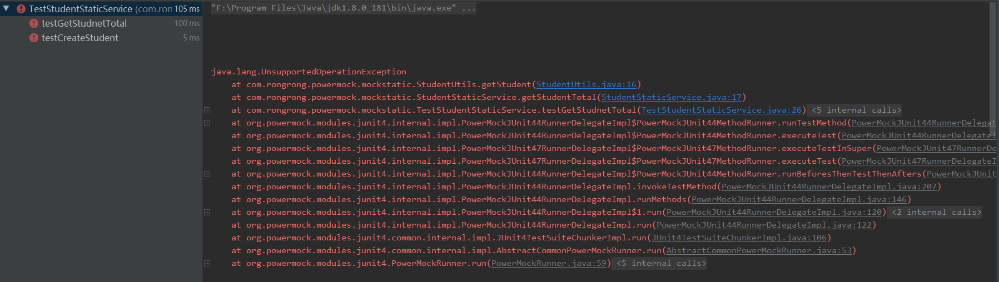
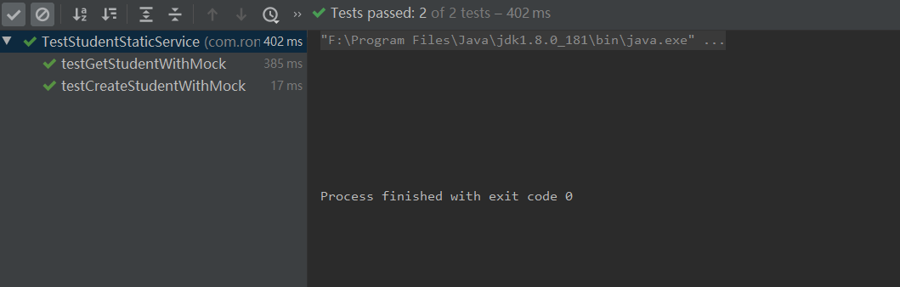

我们编写代码的时候，总会写一些工具类，为了方便调用喜欢使用static关键字来修饰对应方法。

那么现在举例说明，还是准备两个接口，第一个是查询学生总数，第二个是新增学生两个接口，具体示例代码如下：

```
package com.rongrong.powermock.mockstatic;
import com.rongrong.powermock.service.Student;
/**
 * @author rongrong
 * @version 1.0
 * @date 2019/11/23 8:08
 */
public class StudentStaticService {
    /**
     * 获取学生总数
     * @return
     */
    public int getStudentTotal(){
        return StudentUtils.getStudent();
    }
    /**
     * 创建一个学生
     * @param student
     */
    public void createStudent(Student student){
        StudentUtils.createStudent(student);
    }
}
```


接着我们再来看看这个静态工具类StudentUtils，具体代码示例如下：

```
package com.rongrong.powermock.mockstatic;
import com.rongrong.powermock.service.Student;
/**
 * @author rongrong
 * @version 1.0
 * @date 2019/11/23 7:38
 */
public class StudentUtils {
    /**
     * 获取学生总数
     * @return
     */
    public static int getStudent(){
        throw new UnsupportedOperationException();
    }
    /**
     * 创建一个学生
     * @param student
     */
    public static void createStudent(Student student){
        throw new UnsupportedOperationException();
    }
}
```


接下来我们用传统方式，来做单元测试，示例代码如下：

```
@Test
public void testGetStudnetTotal(){
    StudentStaticService staticService = new StudentStaticService();
    int studentTotal = staticService.getStudentTotal();
    assertEquals(studentTotal,10);
}
@Test
public void testCreateStudent(){
    StudentStaticService staticService = new StudentStaticService();
    staticService.createStudent(new Student());
    assertTrue(true);
}
```


接着运行下测试用例，结果肯定报错了，为什么报错，这里就不再细说了，参考之前文章，报错，如下图所示：



接下来我们使用powermock来进行测试，具体示例代码如下：

```
@Test
   public void testGetStudentWithMock(){
       //先mock工具类对象
       PowerMockito.mockStatic(StudentUtils.class);
       //模拟静态类调用
       PowerMockito.when(StudentUtils.getStudent()).thenReturn(10);
       //构建service
       StudentStaticService service = new StudentStaticService();
       int studentTotal = service.getStudentTotal();
       assertEquals(10,studentTotal);
   }
   @Test
   public void testCreateStudentWithMock(){
       //先模拟静态工具类
       PowerMockito.mockStatic(StudentUtils.class);
       //模拟调用
       PowerMockito.doNothing().when(StudentUtils.class);
       //构建service
       StudentStaticService service = new StudentStaticService();
       Student student = new Student();
       service.createStudent(student);
       //这里用powermock来验证，而不是mock，更体现了powermock的强大
       PowerMockito.verifyStatic();
   }
```


再次运行，测试通过，如下图所示：



运行之前先让powermock为我们准备了StudentUtils工具类，而且采用mockstatic的方法，最后我们用powermock.verifyStatic()验证，而不是mock，更体现了powermock的强大。

---
> 参考链接：[https://www.cnblogs.com/longronglang/p/11915449.html](https://www.cnblogs.com/longronglang/p/11915449.html)
