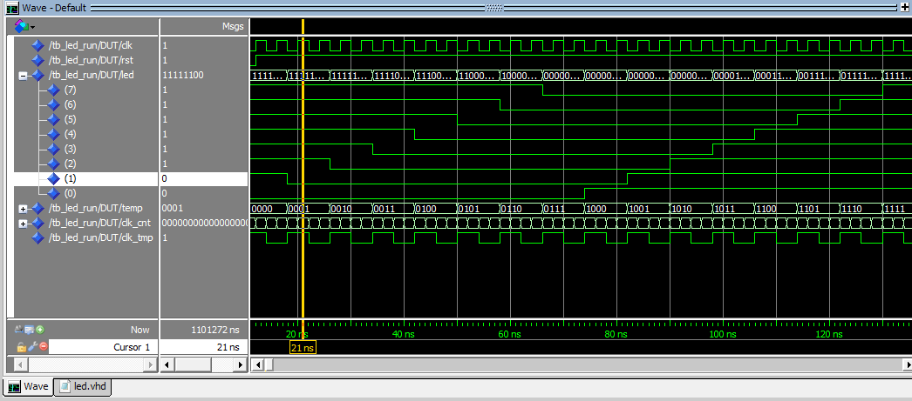

VHDL与Verilog硬件描述语言在数字电路的设计中使用的非常普遍，无论是哪种语言，仿真都是必不可少的。而且随着设计复杂度的提高，仿真工具的重要性就越来越凸显出来。在一些小的设计中，用TestBench来进行仿真是一个很不错的选择。VHDL与Verilog语言的语法规则不同，它们的TestBench的具体写法也不同，但是应包含的基本结构大体相似，在VHDL的仿真文件中应包含以下几点：实体和结构体声明、信号声明、顶层设计实例化、提供激励；Verilog的仿真文件应包括：模块声明、信号声明、顶层设计实例化、提供激励。大致思想都是相似的。

　　简单的说，TestBench就是一种验证手段，从软件层面对设计的硬件电路进行仿真。具体来讲，一般是在你的仿真文件里，产生激励信号，作用于被仿真的设计文件DUT（Design Under Test），产生相应的输出，然后根据输出信号检验设计的电路是否存在问题或者存在哪些问题。

　　下面以FPGA板中驱动流水灯的一段程序为例，简单介绍一下两种语言的TestBench的编写。

```
1 module led_run(clk,rst,led);
 2   input  clk,rst;
 3   output reg [7:0] led;
 4   reg [25:0] clk_cnt;
 5   reg clk_tmp;
 6   reg [3:0] temp;
 7   
 8   always@(posedge clk or negedge rst)
 9   begin
10     if(!rst)
11       begin
12         clk_cnt<=26'd0;
13         clk_tmp<=1'b1;
14       end
15     else
16       begin
17         if(clk_cnt==26'b11111111111111111111111111)
18           begin
19             clk_cnt<=26'd0;
20             clk_tmp<=~clk_tmp;
21           end
22         else
23           clk_cnt<=clk_cnt+1'b1;
24       end
25   end
26   
27   always@(posedge clk_tmp or negedge rst)
28   begin
29     if(!rst)
30       temp<=4'd15;
31     else
32       temp<=temp+1'b1;
33   end
34   
35   always@(temp)
36   begin
37     case(temp)
38       4'd0 :led<=8'b11111110;
39       4'd1 :led<=8'b11111100;
40       4'd2 :led<=8'b11111000;
41       4'd3 :led<=8'b11110000;
42       4'd4 :led<=8'b11100000;
43       4'd5 :led<=8'b11000000;
44       4'd6 :led<=8'b10000000;
45       4'd7 :led<=8'b00000000;
46       4'd8 :led<=8'b00000001;
47       4'd9 :led<=8'b00000011;
48       4'd10:led<=8'b00000111;
49       4'd11:led<=8'b00001111;
50       4'd12:led<=8'b00011111;
51       4'd13:led<=8'b00111111;
52       4'd14:led<=8'b01111111;
53       4'd15:led<=8'b11111111;
54       default:;
55     endcase
56   end
57   
58 endmodule
View Code
```


　　上面是一段流水灯的代码，控制8位流水灯依次点亮，再依次熄灭。第一个always语句完成分频功能，第二个always语句用于计数，共16个值，第三个always语句根据计数的值选择LED灯的状态。其中clk、rst分别为时钟和复位信号，led为驱动流水灯的输出信号。接下来针对这一设计编写其TestBench文件。

```
1 /************TestBench*************/
 2 module tb_led_run;
 3   reg clk,rst;
 4   wire led;
 5   
 6   initial
 7   begin
 8     rst=1;
 9     #30 rst=0;
10     #40 rst=1;
11   end
12   
13   initial
14   begin
15     clk=1;
16     forever #20 clk=~clk;
17   end
18   
19   led_run led1(.clk(clk),.rst(rst),.led(led));
20 endmodule
View Code
```


　　由于只需要时钟和复位信号即可，故在其仿真文件并不复杂，建立测试模块，进行信号声明，在两个initial中分别提供clk和rst信号，最后进行例化。当然注意一点，在仿真时要把分频模块去掉，或者将分频系数改小，否则仿真时不容易观察波形。下面是在Modelsim中仿真得到的波形（分频模块改为2分频）。



　　总结起来，Verilog的TestBench有着相对固定的写法：

```
module test_bench;
  端口声明语句
  initial
  begin
    产生时钟信号
  end
  initial
  begin
    提供激励源
  end
  例化语句
endmodule
View Code
```


　　最主要的是在initial语句中进行激励的生成，这要根据具体的设计来分析。

　　下面对比介绍VHDL语言TestBench的写法。同样的功能，驱动流水灯，VHDL的程序如下：

```
1 LIBRARY IEEE;
 2 USE IEEE.STD_LOGIC_1164.ALL;
 3 USE IEEE.STD_LOGIC_UNSIGNED.ALL;
 4 
 5 ENTITY led_run IS
 6   PORT(clk:in std_logic;
 7   rst:in std_logic;
 8   led:out std_logic_vector(7 downto 0):="11111111" );
 9 END led_run;
10 
11 ARCHITECTURE arc_led_run OF led_run IS
12   signal temp:std_logic_vector(3 downto 0);
13   signal clk_cnt:std_logic_vector(25 downto 0);
14   signal clk_tmp:std_logic:='1';
15   BEGIN
16     divider:PROCESS(clk,rst)
17     BEGIN
18         if(rst='0') then
19           clk_cnt<="00000000000000000000000000";
20         elsif(clk'event and clk='1') then
21           clk_cnt<=clk_cnt+1;
22           if(clk_cnt="11111111111111111111111111") then  
23             clk_cnt<="00000000000000000000000000";
24             clk_tmp<=NOT clk_tmp;
25         end if;
26       end if;
27     END PROCESS;
28     
29     PROCESS(clk_tmp,rst)
30       BEGIN
31       if(rst='0') then
32         temp<="1111";     --all the led off
33       elsif(clk_tmp'event and clk_tmp='1') then
34         temp<=temp+1;
35       end if;
36     END PROCESS;
37     
38     PROCESS(temp)
39       BEGIN
40       case temp is
41       when"0000"=>led<="11111110";
42       when"0001"=>led<="11111100";
43       when"0010"=>led<="11111000";
44       when"0011"=>led<="11110000";
45       when"0100"=>led<="11100000";
46       when"0101"=>led<="11000000";
47       when"0110"=>led<="10000000";
48       when"0111"=>led<="00000000";
49       when"1000"=>led<="00000001";
50       when"1001"=>led<="00000011";
51       when"1010"=>led<="00000111";
52       when"1011"=>led<="00001111";
53       when"1100"=>led<="00011111";
54       when"1101"=>led<="00111111";
55       when"1110"=>led<="01111111";
56       when"1111"=>led<="11111111";
57       when others=>NULL;
58       end case;
59     END PROCESS;
60 
61 END arc_led_run;
View Code
```


　　根据语法要求，首先声明库，接着定义实体和结构体。在结构体中用三个进程(PROCESS)分别实现分频、计数、流水灯状态分配的功能，功能相当于上面Verilog程序中的三个always语句。接下来写TestBench文件：

```
1 ---------------TestBench-----------------
 2 LIBRARY IEEE;
 3 USE IEEE.STD_LOGIC_1164.ALL;
 4 
 5 
 6 ENTITY tb_led_run IS            --空实体
 7 END tb_led_run;
 8 
 9 
10 ARCHITECTURE arc_tb_led_run OF tb_led_run IS        --结构体
11 
12   COMPONENT led_run IS        --元件声明
13     PORT(clk:in std_logic;
14     rst:in std_logic;
15     led:out std_logic_vector(7 downto 0));
16   END COMPONENT;
17 
18   signal clk,rst:std_logic;
19   signal led:std_logic_vector(7 downto 0);
20   constant clk_period:time:=5 ns;
21 
22 BEGIN
23 
24   DUT:led_run PORT MAP(clk=>clk,rst=>rst,led=>led);    --元件例化
25 
26   clk_gen:PROCESS
27   BEGIN
28     clk<='1';
29     wait for clk_period/2;
30     clk<='0';
31     wait for clk_period/2;
32   END PROCESS;
33   
34   tb:PROCESS
35   BEGIN
36     rst<='0';
37     wait for 12 ns;
38     rst<='1';
39     wait;
40   END PROCESS;
41 
42 END arc_tb_led_run;
View Code
```


　　在这个TestBench中同样只需要提供clk和rst信号，分别在两个进程实现，Modelsim中的仿真结果如下(同样在仿真的时候将分频系数改为2)：


　　总结一下，VHDL的TestBench写法也有相对固定的格式：

```
library ieee;                              --库声明
use ieee.std_logic_1164.all;
entity test_bench is                   --测试平台文件的空实体（不需要端口定义)
end test_bench;
architecture tb_behavior of test_bench is     --结构体
    component entity_under_test         --被测试元件的声明
        port(
        list-of-ports-theri-types-and-modes
        );
    end component;
begin
    instantiation:entity_under_test port map        --元件例化
    (
        port-associations
    );
    process()        --产生时钟信号
    ……
    end process;
    process()        --产生激励源
    ……
    end process;
end tb_behavior;
View Code
```


　　相对与Verilog语言来说，VHDL的TestBench除了自身的库声明以及Entity和Architecture之外，还需要进行元件的声明，即将被测试的设计声明为一个元件，然后对其例化。在激励的产生方面与Verilog思路相同。　 

　　从上面的程序可以看出，Verilog语言相对比较随意一些，从C语言编程中继承了多种操作符和结构；而VHDL的语法则比较严谨，有固定的格式。但在功能的实现上二者大同小异。比如Verilog中的always语句，在VHDL中可以找到PROCESS与之对应，当然更多的是不同。两种语言均可在不同的抽象层次对电路进行描述：系统级、算法级、寄存器传输级、逻辑门级和开关电路级，但是VHDL更擅长系统级，而Verilog更方便底层描述。在学习硬件描述语言的时候不妨对比学习一下，相信会对电路设计的理解更加深一层。

---
> 参考链接：[https://www.cnblogs.com/Atsea/p/3702322.html](https://www.cnblogs.com/Atsea/p/3702322.html)
