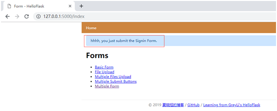
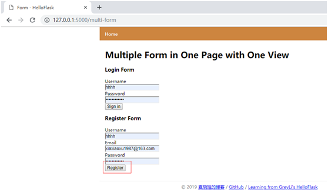
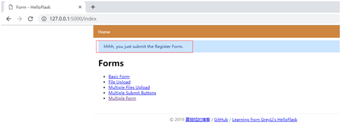
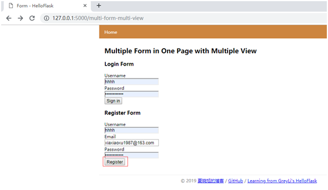
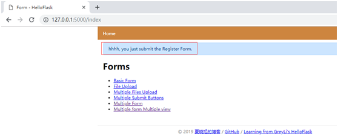
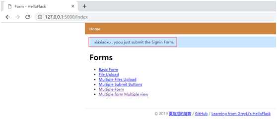
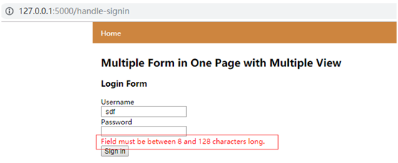

#### 单个页面多个表单

除了在单个表单上实现多个提交按钮，有时还需要在单个页面上创建多个表单。比如，在程序的主页上同时添加登录和注册表单。当在同一个页面上添加多个表单时，我们需要解决的问题是在视图函数中判断当前被提交的是哪个表单。

##### 单视图处理

创建两个表单，并在模板中分别渲染比较容易，但当提交某个表单是，就会遇到问题，Flask-WTF根据请求方法判断表单是否提交，但并不是判断是哪个表单被提交，所以我们需要手动判断，我们知道被单击的提交字段最终的data属性值是布尔值，即True或False。而解析后的表单数据使用input字段的name属性值作为键匹配字段数据，就是说，如果两个表单的提交字段名称都是submit，那么无法判断是哪个表单的提交字段被单击。

解决问题的第一步就是为两个表单的提交字段设置不同的名称，示例程序中的两个表单如下所示：

forms.py:为两个表单设置不同的提交字段名称

```python
from wtforms.validators import Email
class SigninForm(FlaskForm):
    username = StringField('Username',validators=[DataRequired(),Length(1,20)])
    password = PasswordField('Password', validators=[DataRequired(),Length(8,128)])
    submit1 = SubmitField('Sign in')
class RegisterForm(FlaskForm):
    username = StringField('Username', validators=[DataRequired(), Length(1,20)])
    email = StringField('Email', validators=[DataRequired(), Email(), Length(1,254)])
    password = PasswordField('Password', validators=[DataRequired(), Length(8,128)])
    submit2 = SubmitField('Register')
```


在视图函数中，我们分别实例化这两个表单，根据提交字段的值来区分被提交的表单，如下所示：

app.py:

```python
from forms import SigninForm, RegisterForm
@app.route('/multi-form', methods=['GET', 'POST'])
def multi_form():
    signin_form = SigninForm()
    register_form = RegisterForm()
    #validate()逐个对字段调用字段实例化时定义的验证器，返回表示验证结果的布尔值
    if signin_form.submit1.data and signin_form.validate():
        username = signin_form.username.data
        flash('%s, you just submit the Signin Form.' % username)
        return redirect(url_for('index'))
    if register_form.submit2.data and register_form.validate():
        username = register_form.username.data
        flash('%s, you just submit the Register Form.' % username)
        return redirect(url_for('index'))
    return render_template('2form.html', signin_form = signin_form,register_form = register_form)
```


在视图函数中，我们为两个表单添加了各自的if判断，在if语句的内如，分别执行各自的逻辑，以Signinform的if判断为例，如果signin\_form.submit1.data的值是True，那么说明用户提交了登录表单，这时手动调用signin\_form.validate()对表单进行验证。

这两个表单类实例通过不同的变量名称传入模板，以便在模板中渲染对应的表单字段，如下所示：

2form.html:

```html




<h1>Multiple Form in One Page with One View</h1>
<h3>Login Form</h3>
<form method = 'post'>
    {{ signin_form.csrf_token }}
    {{ form_field(signin_form.username) }}
    {{ form_field(signin_form.password) }}
    {{ signin_form.submit1 }}
</form>
<h3>Register Form</h3>
<form method="post">
    {{ register_form.csrf_token }}
    {{ form_field(register_form.username) }}
    {{ form_field(register_form.email) }}
    {{ form_field(register_form.password) }}
    {{ register_form.submit2 }}
</form>


```


访问127.0.0.1:5000/multi-form页面，提交某个表单后，会在重定向后的页面的提示消息中看到提交表单的名称。








##### 多视图处理

除了通过提交按钮判断，更简洁的方法是通过分离表单的渲染和验证实现。这时表单的提交字段可以使用同一个名称，在视图函数中处理表单时也只需要使用我们熟悉的form.validate\_on\_submit()方法。

我们在同一个视图函数内处理两类公国：渲染包含表单的模板(GET请求)、处理表单请求（POST请求）。如果想解耦这部分功能，也可以分离成两个视图函数处理。当处理多个表单时，我们可以把表单的渲染在单独的视图函数中处理，如下所示：

```python
@rouge('/multi-form-multi-view')
def multi_form_multi_view():
    signin_form = SigninForm()
    register_form = RegisterForm()
    return render_template('2form2view.html', signin_form=signin_form, register_form=register_form)
```


这个视图只负责Get请求，实例化两个表单类并渲染模板。另外再为每一个表单单独创建一个视图函数来处理验证工作。处理表单提交请求的视图仅监听POST请求。如下所示：

app.py:使用单独的视图函数处理表单提交的POST请求

```python
@app.route('/handle-signin', methods=['POST'])  # 仅传入POST到methods中
def handle_signin():
    signin_form = SigninForm()
    register_form = RegisterForm()
    if signin_form.validate_on_submit():
        username = signin_form.username.data
        flash('%s , yoou just submit the Signin Form.' % username)
        return redirect(url_for('index'))
    return render_template('2form2view.html', signin_form = signin_form, register_form = register_form)
@app.route('/handle-register', methods=['POST'])
def handle_register():
    signin_form = SigninForm()
    register_form = RegisterForm()
    if register_form.validate_on_submit():
        username = register_form.username.data
        flash('%s, you just submit the Register Form.' % username)
        return redirect(url_for('index'))
    return render_template('2form2view.html', signin_form = signin_form, register_form = register_form)
```


在模板中，表单提交请求的目标URL通过action属性设置，为了让表单提交时将请求发送到对应的URL，我们需要设置action属性，如下所示：

2form2view.html:

```html




<h2>Multiple Form in One Page with Multiple View</h2>
<h3>Login Form</h3>
<form meghod="post" action="{{ url_for('handle_signin') }}">
    {{ signin_form.csrf_token }}
    {{ form_field(signin_form.username) }}
    {{ form_field(signin_form.password) }}
    {{ signin_form.submit }}
</form>
<h3>Register Form</h3>
<form method="post" action="{{ url_for('handle_register') }}">
    {{ register_form.csrf_token }}
    {{ form_field(register_form.username) }}
    {{ form_field(register_form.email) }}
    {{ form_field(register_form.password) }}
    {{ register_form.submit }}
</form>


```


例中index视图：

```python
@app.route('/index')
def index():
    return render_template('index.html')
```

index.html:

```html



<h1>Forms</h1>
<ul>
    <li><a href="{{ url_for('basic') }}">Basic Form</a></li>
    <li><a href="{{ url_for('upload') }}">File Upload</a></li>
    <li><a href="{{ url_for('multi_upload') }}">Multiple Files Upload</a></li>
    <li><a href="{{ url_for('two_submits') }}">Multiple Submit Buttons</a></li>
    <li><a href="{{ url_for('multi_form') }}">Multiple Form</a></li>
    <li><a href="{{ url_for('multi_form_multi_view') }}">Multiple form Multiple view</a></li>
</ul>


```


访问127.0.0.1:5000/2form2view.html，填入必填内容，点击提交，在重定向后的页面上提示提交表单的名称







虽然现在可以正常工作，但是有一个缺点，如果验证未通过，需要将错误消息的form.errors字典传入模板中。如：

```html


<small class="error">{{ message }}</small><br>


```


###### 处理错误处理

在处理表单的视图中传入表单错误信息，就意味着需要再次渲染模板，但是如果视图函数中还涉及大量要传入模板的变量操作，那么这种方式会带来大量的重复。

对于这个问题，一般的解决方式是通过其他方式传递错误消息，然后统一重定向到渲染表单页面的视图。比如使用flash()函数迭代form.errors字典发送错误消息的函数：

```python
def flash_errors(form):
    for field, errors in form.errors.items():
        for error in errors:
            flash(u"Error in the %s field - %s" % (getattr(form, field).label.text, error))
```


如果你希望像往常一样在表单字段下渲染错误消息，可以直接将错误消息字段form.errors存储到session中，然后重定向到用来渲染表单的multi\_form\_multi\_view视图。在模板中渲染表单字段错误时添加一个额外的判断，从session获取并遍历错误消息。

在本例中，错误是在宏里面渲染的：

```html


    {{ field.label }}<br>
    {{ field(**kwargs) }}<br>
    
        
            <small class="error">{{ error }}</small><br>
        
    


```




---
> 参考链接：[https://www.cnblogs.com/xiaxiaoxu/p/10549571.html](https://www.cnblogs.com/xiaxiaoxu/p/10549571.html)