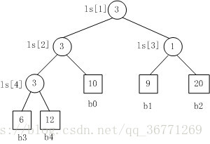
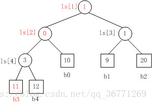
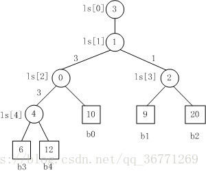
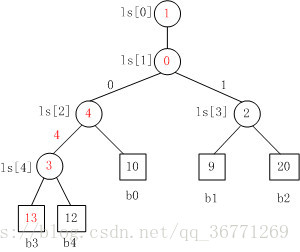

## 前言

本文介绍三种外部排序算法：最小堆、胜者树和败者树，以及为什么外部排序往往用败者树。

## 最小堆

最小堆有以下特点：  
1、最小堆是一颗完全二叉树  
2、每个父节点的值总是小于等于左右孩子节点的值  
3、每个节点的子树都是一个堆树

示例图：

堆常用一维数组结构存储，增删改查的时间复杂度都是 log(n)。操作流程举例：  
1、插入操作  
（1）将插入元素放到数组末尾  
（2）从新插入元素位置开始，将数组头方向开始调整，或者树结构上说，就是向上调整

2、查询操作  
（1）取出堆顶元素，并将数组最后一个元素赋值到堆顶  
（2）树结构上，向下调整

## 胜者树

胜者树的特点：  
1、胜者树，是一棵完全二叉树  
2、每个叶子节点表示一个选手，记录选手的标号  
3、每个非叶子节点表示一场比赛，记录胜者的标号，而每层也就表示一轮比赛

胜者树示例（数值小的胜出，非叶子节点对应 b 后面的标号）：

将 b3 替换成 11，胜者树重构示例：

重构过程中，先取到父节点的值，拿到选手对应的标号，然后再根据标号拿到选手的值和新插入选手的值比较，胜者写到父节点。

## 败者树

败者树：  
1、败者树，也是一颗完全二叉树  
2、每个叶子节点表示一个选手，记录选手的标号  
3、每个非叶子节点表示一场比赛，记录败者的标号，胜者晋级上一层。并且，因为树根节点记录的是败者的标号，会再新建一个节点记录最终胜者的标号。

败者树示例（数值大的失败）：

将 b3 替换为 13，败者树重构示例：

重构上比胜者树有优化，只需要取父节点的值并进行比较。

## 为什么外部排序往往用败者树

从历史的发展上来看，首先选择用来做外部排序的是最小堆。它的插入和查询复杂度都是 log(n)，可以说比较高效。不过，堆调整时，**每个节点都需要和左右孩子进行比较，即需要两次比较**，在外部排序中，也就是需要读取两次外存，那能不能再优化下呢？

于是，研究出了胜者树。胜者树只需要和兄弟节点进行比较，减少了一般的比较量。但是，**胜者树还需要从父节点取一次值，并且，因为新插入的值取代了原先的最优胜者，这个新值向上调整的过程中，必定需要修改父节点的值，即必须要更新胜者**。那能不能再优化呢？

既然有胜者树，那自然也有败者树。败者树解决了胜者树存在的弊端，**只需要和父节点比较一次，并且新插入的值向上调整过程中，不一定要更新。**

综上所述，目前外部排序大多采用的都是败者树算法实现的。侧面也反应出，外部排序（文件排序）的瓶颈在于访存，而不是计算。

## 参考

* [1] [https://www.zhihu.com/question/35144290](https://www.zhihu.com/question/35144290 "https://www.zhihu.com/question/35144290")
* [2] [https://blog.csdn.net/qq\_36771269/article/details/80390980](https://blog.csdn.net/qq_36771269/article/details/80390980 "https://blog.csdn.net/qq_36771269/article/details/80390980")

---
> 参考链接：[https://www.cnblogs.com/flowers-bloom/p/three-external-sorting-algorithm.html](https://www.cnblogs.com/flowers-bloom/p/three-external-sorting-algorithm.html)
