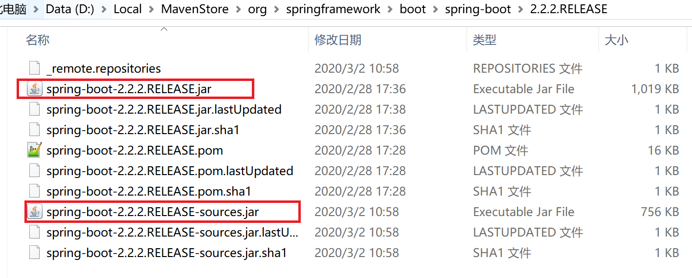

使用maven-pom进行依赖管理与自动构建

* [使用maven-pom进行依赖管理与自动构建](#使用maven-pom进行依赖管理与自动构建)
  + [一、让我们先了解一下maven](#一让我们先了解一下maven)
    - [1.maven是优秀的依赖管理工具](#maven是优秀的依赖管理工具)
    - [2.maven是优秀的构建工具](#maven是优秀的构建工具)
    - [3.maven是约定大于配置、简单易学的工具](#maven是约定大于配置简单易学的工具)
  + [二、pom基本结构](#二pom基本结构)
    - [1.概览](#概览)
    - [2.项目坐标](#项目坐标)
    - [3.package标签](#package标签)
    - [4.项目间关系](#项目间关系)
    - [5.dependencies标签](#dependencies标签)
    - [6.dependencyManagement标签](#dependencymanagement标签)
    - [7.Properties标签](#properties标签)
  + [三、配置构建任务](#三配置构建任务)
    - [1.maven构建的生命周期](#maven构建的生命周期)
    - [2.插件的“构建阶段”](#插件的构建阶段)
    - [3.build标签](#build标签)
    - [4.profiles标签](#profiles标签)
    - [5.project标签下的build标签](#project标签下的build标签)
    - [5.Reporting标签](#reporting标签)

# 使用maven-pom进行依赖管理与自动构建

**最后编辑于 :pencil:**：`{docsify-updated}`

### 一、让我们先了解一下maven

#### 1.maven是优秀的依赖管理工具

随着开发生态环境的不断发展，几乎所有的java应用都会使用第三方的类库，尤其是在这个开源的世界里， java应用依赖管理已经很难再由人工完成——依赖管理包括解决依赖传递、版本冲突、依赖臃肿等问题。

maven通过`groupId`、`artifactId`、`version`形成的坐标定位系统能准确的定位每一个构件(artifact)， 开发者可以通过在pom文件中列出所依赖的构件的坐标，让maven工具从maven仓库中自动下载所有需要的构件； 另一方面，通过pom文件间的依赖传递、继承等方式降低依赖管理的难度。

#### 2.maven是优秀的构建工具

在我们的开发过程中，除了编写代码以外，有很大一部分时间是花在编译、运行单元测试、生成文档、打包和部署这些工具上， 为也提高工作效率，使开发人员能更多的将精力用于开发工作，我们需要像maven这样的工具， 如流水线般的将所有部署以自动化的方式完成。

#### 3.maven是约定大于配置、简单易学的工具

在java开发中，常用的构建工具有Ant、maven、gradle三种。

##### 3.1 Ant

Ant是过程式的，开发者需要显示的指定每个目标，以及完成该目标锁需要执行的任务。

Ant不仅限于对java项目进行构建，也可以对其他语言（如C语言）的项目进行构建。

```
<project name="MyProject" default="dist" basedir="../../../../../../../ProgramFiles/JetBrains/IntelliJ IDEA 2019.3.2/jbr/bin">
  <description>
    simple example build file
  </description>
  <!-- set global properties for this build -->
  <property name="src" location="src"/>
  <property name="build" location="build"/>
  <property name="dist" location="dist"/>
  <target name="init">
    <!-- Create the time stamp -->
    <tstamp/>
    <!-- Create the build directory structure used by compile -->
    <mkdir dir="${build}"/>
  </target>
  <target name="compile" depends="init"
        description="compile the source">
    <!-- Compile the Java code from ${src} into ${build} -->
    <javac srcdir="${src}" destdir="${build}"/>
  </target>
  <target name="dist" depends="compile"
        description="generate the distribution">
    <!-- Create the distribution directory -->
    <mkdir dir="${dist}/lib"/>
    <!-- Put everything in ${build} into the MyProject-${DSTAMP}.jar file -->
    <jar jarfile="${dist}/lib/MyProject-${DSTAMP}.jar" basedir="${build}"/>
  </target>
  <target name="clean"
        description="clean up">
    <!-- Delete the ${build} and ${dist} directory trees -->
    <delete dir="${build}"/>
    <delete dir="${dist}"/>
  </target>
</project>
```


与maven、gradle不同，ant本身没有对应的中央仓库，如果想使用maven一样， 通过声明的方式管理依赖，并自动处理依赖管理等问题，则使用集成ivy插件管理依赖。 但ant不支持多模块的管理方式，而maven和gradle支持。

ant的这种声明方式，使开发者可以根据自己的需要灵活配置，定制自己的项目构建流程； 另一方面，这种灵活的配置方式，也使得ant的配置相对繁琐，可读性较差，学习成本也更高 ——事实上，ant的官方网站上列出的插件就有139种，而且部分工具的官网已经404了。

##### 3.2 maven

maven与gradle一样，都是声明式的配置方式，相对于Ant来说，配置更加方便。 同时maven有内建生命周期，约定了项目的代码结构，只须简单配置，就可以完成构建任务。

> 顶级pom中定义的项目结构（即默认项目结构）

```
项目根目录
  |-- src
  |    |-- main
  |    |    |-- java        -> 主代码文件
  |    |    |-- resources   -> 主资源文件
  |    |     -- scripts     -> 虽然在maven的默认结构里有这个目录，但官网文档中已删除了这一级目录，不建议使用
  |     -- test
  |         |-- java        -> 测试代码文件
  |          -- resources   -> 测试资源文件
   -- pom.xml
```


*小提示：可通过`mvn -DarchetypeCatalog=internal archetype:generate`初始化标准结构的maven项目*

另一方面，maven内建生命周期，使用无法更加项目的构建顺序，如果想在构建中加上一些其他处理逻辑， 则需要用编写maven插件的方式来完成，成本相对高昂。

##### 3.3 Gradle

gradle是相对新颖的构建工具，它使用一种基于Groovy的特定领域语言(DSL)来声明项目设置， 目前也增加了基于Kotlin语言的kotlin-based DSL，抛弃了基于XML的各种繁琐配置。

gradle没有maven般的生命周期，真正起作用的是所引入的Plugin，因此相对更为灵活。

另一方面，gradle作为新生工具，无论是程序还是文档都在不断的完善中，使用和学习相对困难。 同时，由于gradle的配置是基于groovy/kotlin语法的，因此使用gradle需要掌握相应的语法知识。

gradle是对ant和maven特点折衷的结果，相对于ant其可读性更好，相对于maven其更为灵活。

### 二、pom基本结构

POM是**project object mode**的简写，maven通过pom文件对项目进行描述， 在开发者在pom文件中对项目属性和构建过程进行定义后，maven即可自动构建项目并生成站点。

#### 1.概览

```
<project xmlns="http://maven.apache.org/POM/4.0.0"
         xmlns:xsi="http://www.w3.org/2001/XMLSchema-instance"
         xsi:schemaLocation="http://maven.apache.org/POM/4.0.0
                      http://maven.apache.org/xsd/maven-4.0.0.xsd">
    <modelVersion>4.0.0</modelVersion>
    <!-- The Basics -->
    <groupId>...</groupId>
    <artifactId>...</artifactId>
    <version>...</version>
    <packaging>...</packaging>
    <dependencies>...</dependencies>
    <parent>...</parent>
    <dependencyManagement>...</dependencyManagement>
    <modules>...</modules>
    <properties>...</properties>
    <!-- Build Settings -->
    <build>...</build>
    <reporting>...</reporting>
    <!-- More Project Information -->
    <name>...</name>
    <description>...</description>
    <url>...</url>
    <inceptionYear>...</inceptionYear>
    <licenses>...</licenses>
    <organization>...</organization>
    <developers>...</developers>
    <contributors>...</contributors>
    <!-- Environment Settings -->
    <issueManagement>...</issueManagement>
    <ciManagement>...</ciManagement>
    <mailingLists>...</mailingLists>
    <scm>...</scm>
    <prerequisites>...</prerequisites>
    <repositories>...</repositories>
    <pluginRepositories>...</pluginRepositories>
    <distributionManagement>...</distributionManagement>
    <profiles>...</profiles>
</project>
```


#### 2.项目坐标

声明式的项目依赖管理，除了需要一个存储有所有jar包的中央仓库外，还需要一套合适的命名系统， 能够保证每个jar包都有一个唯一的名字，包括不同版本。  
在maven中，jar包的坐标通过`groupId`、`artifactId`、`version`三个字段决定， 类似于xyz坐标系的三个轴。

```
<project xmlns="http://maven.apache.org/POM/4.0.0"
  xmlns:xsi="http://www.w3.org/2001/XMLSchema-instance"
  xsi:schemaLocation="http://maven.apache.org/POM/4.0.0
                      http://maven.apache.org/xsd/maven-4.0.0.xsd">
  <modelVersion>4.0.0</modelVersion>
  <groupId>org.codehaus.mojo</groupId>
  <artifactId>my-project</artifactId>
  <version>1.0</version>
</project>
```


##### 2.1 groupId

通常而言，一个组织（公司、基金会等）的项目通常使用同一个groupId， 因此一般而言groupId是该组织所拥有的域名，如jacoco对应的groupId为`org.jacoco`， 而对应的网站为`http://jacoco.org`（域名的优先级顺序是反过来的），

事实上不一定严格遵循该规则，如maven的groupId为`org.apache.maven`， 而maven官方插件的groupId为`org.apache.maven.plugins`， 尽管同并不存在`plugins.maven.apache.org`这个四级域名， 而且他们同属于apache基金会(apache.org)下的项目。

另外也有完全和域名不相关的，如junit包的groupId为`junt`。

另外需要注意的一点是，虽然groupId不必与项目的包结构相对应，但是遵循这种做法是一种最佳实践， 因为这样可以有效避免包之间的类冲突。

##### 2.2 artifactId

artifactId通常是已知项目（或项目模块）的名称，它与groupId一起构成了一个项目（或项目模块）的定位， 用于将该项目（或项目模块）与世界上其他所有项目（或项目模块）分开。

> 实践

虽然在groupId中就可以看到项目名称，但在artifactId中一般仍会将项目名称作为开头， 这是因为我们在沟通时通常会用 artifactId 进行交流，而不会带上 groupId ， 如张三告诉李四需要在项目中引入`maven-enforcer-plugin`包做项目自动检查。

##### 2.3 version

如同字面的含义，version代表的是项目（或项目模块）的版本。

`groupId`、`artifactId`、`version`一同定位了一个发布包的唯一位置。 如**maven-enforcer-plugin-3.0.0-M3.jar**在仓库中的位置为 `$M2_REPO/org/apache/maven/plugins/maven-enforcer-plugin/3.0.0-M3`， 而其对应的pom中的内容如下：

```
<parent>
  <groupId>org.apache.maven.enforcer</groupId>
  <artifactId>enforcer</artifactId>
  <version>3.0.0-M3</version>
</parent>
<groupId>org.apache.maven.plugins</groupId>
<artifactId>maven-enforcer-plugin</artifactId>
```


> parent标签我们后续会提到，*parent标签*下是父pom的坐标，子pom继承父pom的所有定义，包括version

#### 3.package标签

*package标签*定义了构件的打包方式和使用方式，如果不指定值，默认使用jar作为打包方式。

这里只说明两个我们使用较多的打包方式：pom、jar。

##### 3.1 打包为pom

定义打包方式为pom是有一些特殊的项目，其本身除了pom文件外，不包含其他文件， 这些项目中的pom主要是用来被其他项目引用、继承，或者用来管理项目拥有的模块。

> 这里的继承概念与java中类的继承概念类似，子pom拥有父pom的所有配置， 可以通过自定义的方式覆盖/复写父pom中已经存在的配置。

我们拿springboot集成中的两个打包方式为pom的项目举例说明。 在springboot的官方集成教程中，会告诉你可以使用两种方式集成，一种通过父pom继承:

```
<parent>
    <groupId>org.springframework.boot</groupId>
    <artifactId>spring-boot-starter-parent</artifactId>
    <version>2.1.1.RELEASE</version>
</parent>
```


另一种是通过引入spring-boot的依赖管理:

```
<dependencyManagement>
    <dependencies>
        <dependency>
            <!-- Import dependency management from Spring Boot -->
            <groupId>org.springframework.boot</groupId>
            <artifactId>spring-boot-dependencies</artifactId>
            <version>2.1.1.RELEASE</version>
            <type>pom</type>
            <scope>import</scope>
        </dependency>
    </dependencies>
</dependencyManagement>
```


如果我们找到**spring-boot-starter-parent**项目，就会发现这个项目里仅仅只有pom文件 

这是因为在项目中，我们通常会存在多个子模块，而这些子模块会需要一些公用的配置， 比如统一的构建流程、统一的依赖版本管理，而这些内容就以pom的形式抽取出来， 形成了这种打包方式为pom的项目。

需要注意的是，打包方式为pom的项目里，除了pom文件，其他文件不会参与构建。 事实上如果我们去看pom打包对应的默认插件配置就会发现，只有install和deploy两个生命周期有插件绑定：

```
<phases>
  <install>
    org.apache.maven.plugins:maven-install-plugin:2.4:install
  </install>
  <deploy>
    org.apache.maven.plugins:maven-deploy-plugin:2.7:deploy
  </deploy>
</phases>
```


##### 3.2 打包为jar

jar包是java程序包常用的发布形式，其可以作为库文件被其他项目使用， 也可以通过`java -jar`命令直接运行。

jar包中即有静态资源，也有编译后生成的class文件，这意味着其打包流程也更为复杂：

```
<phases>
  <process-resources>
    org.apache.maven.plugins:maven-resources-plugin:2.6:resources
  </process-resources>
  <compile>
    org.apache.maven.plugins:maven-compiler-plugin:3.1:compile
  </compile>
  <process-test-resources>
    org.apache.maven.plugins:maven-resources-plugin:2.6:testResources
  </process-test-resources>
  <test-compile>
    org.apache.maven.plugins:maven-compiler-plugin:3.1:testCompile
  </test-compile>
  <test>
    org.apache.maven.plugins:maven-surefire-plugin:2.12.4:test
  </test>
  <package>
    org.apache.maven.plugins:maven-jar-plugin:2.4:jar
  </package>
  <install>
    org.apache.maven.plugins:maven-install-plugin:2.4:install
  </install>
  <deploy>
    org.apache.maven.plugins:maven-deploy-plugin:2.7:deploy
  </deploy>
</phases>
```


##### 3.2 其他

目前maven支持这些打包方式: pom、jar、maven-plugin、ejb、war、ear、rar。 其中每种打包方式都有相应的打包插件对其进行打包，这些插件都已经被maven默认进行了绑定， 具体打包方式对应的插件配置有兴趣的可以去 [官网](maven.apache.org/ref/3.6.3/maven-core/default-bindings.html)进行查看。

#### 4.项目间关系

在上文中我们提到了多种项目间关系，包含依赖关系、继承关系、聚合关系（上文提到的模块管理）。

##### 4.1依赖关系

项目间依赖关系是最常用的关系，当我们项目A使用一个项目B打成的jar时，A就对B形成了依赖。

需要注意的是，如果的java项目开发已经无法离开依赖了，A所依赖的项目B，实际上也开发中也依赖了项目C。 此时就生成的**依赖的传递**，即如果A依赖了B，B依赖了C，那么A依赖C。

依赖传递的存在，会使得单点的依赖关系也变得复杂起来。实际在项目中，我们会依赖大量的jar包， 此时就可能存A依赖的B、C同时使用两个不同版本的D:

```
A
 |-B
    |-D:1.1
 |-C
    |-D:1.2
```


我们知道，一个项目的不同版本通常会有大量的类是重复了，如果jvm在加载同名类时，会忽略重复的类， 这样可能导致出现其中一个包只有一半代码的情况，这明显是不合理的。这种依赖的出现就叫到依赖冲突， 当出现冲突时，maven会选取其中的一个版本放入最终的打包后文件中(如jar)，而忽略其他版本。

*具体的选取策略可以参考[这篇短文](https://www.cnblogs.com/ygj0930/p/6628429.html)*

##### 4.2继承关系

继承关系我们在上文中已经提到，我们可以通过*parent标签*引入父级pom， 此时子pom拥有了父级pom中的所有定义，并可以在子pom中复写相应的定义。

由于pom的继承关系可能有多级，因此如果你想确认当前项目的最终pom结构时， 就必须要将所有的pom整合到一起，此时我们可以通过`mvn help:effective-pom`命令生成整合后的pom （如果使用idea，右键maven菜单下也有相应的生成操作）。

如果在一个没有父pom的项目中执行`mvn help:effective-pom`，你会发现最终生成的pom中， 突然出现了大量你没有定义的内容，这是因此maven自身定义了一个**super pom**， 所有的pom都默认继承该pom（可类比java中的Object类）， 在上文中我们提到的maven项目的默认结构，就是在这里定义的。

> super pom的具体内容，可以去[官网](http://maven.apache.org/pom.html#The_Super_POM)查看

子pom并不会继承父pom的所有内容，仅以下内容将会被继承: - **groupId** - **version** - scm - issueManagement - ciManagement - mailingLists - **properties** - **dependencyManagement** - **dependencies** - **repositories** - pluginRepositories - **build** - **reporting** - **profiles** - description - url - inceptionYear - organization - licenses - developers - contributors

需要注意的是以下几个标签不会被继承： - artifactId - package - name - prerequisites

##### 4.3聚合关系

聚合关系常常出现在有多个模块的项目中，比如项目A有三个子项目aa、ab、ac， 这时我们可以在目录A下也添加一个pom，并定义aa、ab、ac是项目A的三个子项目， 这样我们对项目A做构建（如mvn clean package）时，maven就会分别对aa、ab、ac做相应的构建操作。

```
A
 |-- pom.xml
 |-- aa
       |-- pom.xml
 |-- ab
       |-- pom.xml
 |-- ac
       |-- pom.xml
```


子项目的声明方式以通过*modules标签*进行，当我们在项目A的pom中添加如下配置， aa、ab、ac就会成为A的子项目:

```
<modules>
    <module>aa</module>
    <module>ab</module>
    <module>ac</module>
</modules>
```


> aa、ab、ac并不是这三个项目的相对路径（相对于A）

在这里，可能有的人已经注意到了，这种项目层级结构，非常适合将A项目的pom作为父pom， 将aa、ab、ac的pom中相同的内容抽取至父pom中进行管理。  
实际上在项目的实践中，通常也是这么处理的，但也有一些例外。比如aa、ab是springboot项目， 而ac却是老旧的spring项目，此时可能出现：A作为aa和ab的父级pom统一管理相关配置，
同时aa和ab作为子项目存在，而ac不继承A，只作为子项目存在，这样我们即能够统一管理aa和ab的配置， 也能够通过一条命令，对aa、ab、ac一起完成构建操作。
（实际实践过程中，不推荐这种模式，我们可以把ac提到与A平级的位置，这样的结构更清晰）

值得一提的是，如果aa与ab间存在依赖关系，比如aa依赖于ab，那么即使aa比ab先声明，maven在构建时， 也会很聪明的先对ab进行构建，再构建aa。

#### 5.dependencies标签

```
<dependencies>
    <dependency>
      <groupId>junit</groupId>
      <artifactId>junit</artifactId>
      <version>4.12</version>
      <type>jar</type>
      <scope>test</scope>
      <optional>true</optional>
    </dependency>
</dependencies>
```


*dependencies标签*下声明了当前项目所使用的依赖构件。

需要注意的是，这里声明的文件必须能够在maven仓库中找到， maven默认使用中央仓库，中央仓库中包括了所有常用的开源jar包， 但对于一些闭源的三方jar包，就无法在中央仓库中找到。  
因此，公司一般都会有自己的私有仓库，我们需要修改maven的settings.xml文件， 使maven使用私服处理依赖和发布。  
对于私有仓库上没有的项目，我们可能通过以下命令，将其上传至私有仓库：

`shell script mvn deploy:deploy-file -Dfile=non-maven-proj.jar -DgroupId=some.group \
-DartifactId=non-maven-proj -Dversion=1.0 -Dpackaging=jar`

##### 5.1 classifier标签

在引用依赖时，仅仅使用`groupId`、`artifactId`、`version`作为坐标可能还并不太足够。
考虑一下这种场景：有一个项目，该项目需要提供一个基于jre1.7的jar包， 同时还提供了一个基于jre1.8的jar包，即一套源码需要使用两种jdk打成不同的jar包。

这种情况下我们会配置两套打包方式，默认使用1.8打包，并可选择1.7打包，配置如下:

```
<profile>
    <id>jdk17</id>
    <properties>
        <!--使用jdk1.7打包-->
        <java.version>1.7</java.version>
    </properties>
    <build>
        <plugins>
            <plugin>
                <artifactId>maven-jar-plugin</artifactId>
                <executions>
                    <execution>
                        <phase>package</phase>
                        <goals>
                            <goal>jar</goal>
                        </goals>
                        <configuration>
                            <!--配置classifier，与1.8版本的包区分-->
                            <classifier>jdk17</classifier>
                        </configuration>
                    </execution>
                </executions>
            </plugin>
        </plugins>
    </build>
</profile>
```


如果用1.8打包发布的jar名称为`demo-1.0.jar`，那么用1.7打包时， 发布的jar的名称为`demo-1.0-jdk17.jar`——实际场景下，*classifier标签*可以配置成任意字符串， 并不一定是jdk17。

而使用者在引入1.7版本的依赖时，就需要额外添加*classifier标签*。

```
<dependency>
  <groupId>some.example</groupId>
  <artifactId>demo</artifactId>
  <version>1.0</version>
  <classifier>jdk17</classifier>
</dependency>
```


*classifier标签*有一处更常见的地方，是`sources.jar`:  


这就是我们上文中说到的一个pom，打出了两个包，源码包对应的*classifier标签*就是`sources`， 而测试源码包对应的值为`test-sources`。

##### 5.2 type标签

*type标签*描述了依赖类型，如果不定义该值，使用默认值jar。  
对于不同类型的依赖，maven的处理策略也不相同:

| type | classifier | extension | packaging | language | added to classpath | includesDependencies |
| --- | --- | --- | --- | --- | --- | --- |
| pom |  | = type | = type | none |  |  |
| jar |  | = type | = type | java | true |  |
| test-jar | tests | jar | jar | java | true |  |
| maven-plugin |  | jar | = type | java | true |  |
| ejb |  | jar | = type | java | true |  |
| ejb-client | client | jar | ejb | java | true |  |
| war |  | = type | = type | java |  | true |
| ear |  | = type | = type | java |  | true |
| rar |  | = type | = type | java |  | true |
| java-source | sources | jar | = type | java |  |  |
| javadoc | javadoc | jar | = type | java | true |  |

实际开发中，我们只会用到`jar`和`pom`两种类型，大家可以注意到`pom`类型的依赖是不会产生依赖传递，
也不会被加入**classpath**中。

##### 5.3 scope标签

该标签定义了该包在哪些阶段会被放到**classpath**中，另外还定义了依赖的可传递性。其聚会范围如下：

**classpath**即类、类库加载路径，在我们的依赖中，大多数依赖会在编译、测试、运行都用到， 但也有一些依赖可能只有在编译、测试阶段运到（比如测试相关的包），还有部分包可能在编译、测试时需要，
但实际发布时不需要（比如jdk相关的包）。

| 值 | 含义 | 是否会将该依赖向下传递 |
| --- | --- | --- |
| compile | 该值是默认值。该依赖在所有阶段的都会放入**classpath**中，是最常用的值。 | 是 |
| provided | 只有在编译和测试时放入**classpath**中，实际打包时忽略该包 | 否 |
| runtime | 编译时不需要，只在测试和打包时需要 | 是 |
| test | 只在对测试代码做编译和执行时需要 | 否 |
| system | 手动指定所依赖包的本地存在路径 | 只传递本身 |

* **compile**是最常用的，一般项目引入的包在编译、测试、发布阶段都会用到。
* **provided**一般用于基础包，在基础包的开发过程中会依赖一些三方包， 但可能不想为使用者带来依赖冲突的负担，此时可以使用该范围，由使用者自行决定该三方包的版本
  （当然需要是兼容的版本）；另一种不推荐的使用方式是将该依赖作为可选依赖向下传递， 举一个例子：我们开发了一个基础工具类包，里面含有许多工具，像poi工具、时间转换工具、中文数字工具，
  另外里面还包含了TapConfigUtil用来获取配置， 此时我们注意到配置中心的集成是以**springboot**为基础的， 而我们想让该工具包也可以被其他类型的项目使用，
  这种情况下我们可以给`commons-aap-appconfig`包加上**provided**范围。
  如果某个使用者只不需要使用TapConfigUtil，那么他就不需要引入`commons-aap-appconfig`包。
  (事实上`commons-aap-appconfig`包里引入spring相关的依赖里使用了**provided**范围)
* **runtime**很少用到，一般情况下使用**compile**就可以了， 使用**runtime**甚至可能给IDE带来一些问题
* **test**用在测试相关的包上，测试代码的安全性会更低（毕竟没人会写测试代码来测试测试代码 ——对外发布的测试工具除外），使用**test**标记测试相关的包，可以避免被其他开发人员错误的使用。
* **system**需要配置`systemPath`标签使用，用来指定使用仓库中没有的包。
  与其相比，上传私服是一种更好的方式，因为**system**标记的包，并不会将其依赖的包传递给使用者， 这意味着你需要自己处理好依赖关系。

##### 5.4 systemPath标签

仅在依赖项范围是system时使用，否则构建将失败。  
*systemPath标签*中的路径必须是绝对路径，因此建议使用maven变量拼装路径， 例如${project.basedir}/lib。

##### 5.5 optional标签

在上面介绍*scope标签*的**provided**取值时，我们讲了它可以实现让使用都按需决定是否引入依赖， 这样以达到避免引入不需要的依赖。  
事实上**provided**更多的是用来要求使用方或运行时系统提供具体的包，而不是用于这种用途。  
配置依赖的可选应该使用*optional标签*来实现。

##### 5.6 exclusions标签

*dependency标签*下还存在*exclusions标签*，我们在前面讲到了依赖传递可能带来的依赖冲突问题， *exclusions标签*就是排除掉不想被传递过来的依赖。

这里需要注意的是，A->B->C时，如果你在引入依赖A的时候，将B排除，那么C也将被排除， 除非有其他地方也引入了C（有点像对“树”进行操作，排除进相当于直接剪掉了一个“子树”）

```
<exclusions>
    <exclusion>
        <groupId>org.objenesis</groupId>
        <artifactId>objenesis</artifactId>
    </exclusion>
</exclusions>
```


exclusion下只有*groupId*与*artifactId*两个标签，因为只不可能同时依赖一个包的不同版本。

##### 5.7 其他

*version标签*除了指定具体版本外，还可以指定范围版本，有兴趣的可以查看 [官网](https://maven.apache.org/pom.html#Dependency_Version_Requirement_Specification)， 不过不推荐在项目中使用。

各小版本在maven项目中的先后发布顺序可以看 [这里](https://maven.apache.org/pom.html#Version_Order_Specification)

#### 6.dependencyManagement标签

正如其名字所代表的含义，该标签的作用就是管理依赖。  
在上面的*dependency标签*的介绍中，我们看到在*dependency标签*下有众多的子标签， 想象一下我们有多个服务，如果每个服务都在引入同一依赖时配置好所有内容，
那将是非常麻烦，而且如果需要对某个所依赖的jar包做升级时，我们不得不改每一个pom中的version信息。

可能有人已经想到，我们可以将这些依赖放到父pom里面就可以了。这是一种很好的策略， 但让我们考虑项目A、B，A中引入了a、b三个包，B中引入b、c两个包，
如果我们使用父pom管理公用依赖，将只有b会被放到父pom里，而a、c由A、B自己管理。 如果后来B项目的功能增加，也需要引入a包，那么我们就需要把a包从A项目中提到父pom中，
以保证对依赖的统一管理——因为，这种方式并不能真正实现依赖的统一管理。

现在考虑另一种方式，我们在父pom里列出项目中所有使用到的依赖包，并配置好所有内容， 但并不真正的对这些包产生依赖，仅仅是列出来。如果那个子pom真正需要用到， 那么他只需要声明一些尽可能少的信息，就可以对对应的包产生依赖
——这种方案就是使用*dependencyManagement标签*。

```
<dependencyManagement>
    <dependencies>
        <dependency>
            <groupId>org.springframework.boot</groupId>
            <artifactId>spring-boot-dependencies</artifactId>
            <version>${spring.boot.version}</version>
            <type>pom</type>
            <scope>import</scope>
        </dependency>
        <dependency>
            <groupId>com.demo.company</groupId>
            <artifactId>someproject-commons-versions</artifactId>
            <version>1.0.0</version>
        </dependency>
    </dependencies>
</dependencyManagement>
```


*dependencyManagement标签*下只有一个*dependencies标签*， 里面的内容和上文中的*dependencies标签*几乎一样，唯一不一样的是， 在*dependencyManagement标签*下的*scope标签*新增一种取值——**import**。

*import*只能用于导入*package*值为**pom**的依赖包， 当在项目A的pom中使用*import*导入项目B时，A、B的*dependencyManagement标签*下的内容将被合并。 这是一个非常有用的特性，这意味着我们可以创建一个项目专门用来做统一版本控制， 在这个项目里，我们将所有的包的*version*、*scope*等内容都定义好， 其他项目只需要在*dependencyManagement*下导入该包，而不需要破坏其本身的继承结构。

虽然*dependencyManagement*有这样的方便， 但需要注意的是*dependencyManagement*下的内容不仅对当前pom、子pom生效， 同样会覆盖由于依赖传递而引入的jar包。比如在项目A中，我们依赖了aa-1.0、bb-2.0， 而在bb-2.0中依赖了aa-2.0，此时，如果aa的版本是在*dependencyManagement*中定义， 那么aa-2.0将被放弃，aa-1.0生效，这样将导致bb-2.0可能使用了根本不存在的类和api， 最终项目构建失败。

#### 7.Properties标签

如其字面意思——属性。*properties标签*下定性的属性，可以在pom的任何地方被引用， 引用方式为`${属性名}`，其中属性名即标签名，我们可以利用这些属性管理一组依赖， 或者将一些容易变化的值集中到*properties标签*下管理。

```
<properties>
    <org.powermock.version>2.0.2</org.powermock.version>
</properties>
<dependencies>
    <dependency>
        <groupId>org.powermock</groupId>
        <artifactId>powermock-module-testng</artifactId>
        <version>${org.powermock.version}</version>
        <scope>test</scope>
    </dependency>
    <dependency>
        <groupId>org.powermock</groupId>
        <artifactId>powermock-api-mockito2</artifactId>
        <version>${org.powermock.version}</version>
        <scope>test</scope>
    </dependency>
    <dependency>
        <groupId>org.powermock</groupId>
        <artifactId>powermock-module-junit4</artifactId>
        <version>${org.powermock.version}</version>
        <scope>test</scope>
    </dependency>
</dependencies>
```


除了自定义属性外，maven插件也会提供一些属性，以达到对其进行配置的目的。 同时，maven还提供以下属性可以在pom文件中使用： - env.X : 以前缀`env`开头的属性，对应于系统环境变量， 比如通过`${env.PATH}`可以取到环境变量`PATH`的值。这里需要注意的是， maven对环境变量的大小写是敏感的，windows下的环境变量在maven中必须全部大写。 - project.X : `project`为前缀是属性是项目的属性值， 包括了pom中的标签——比如${project.parent.artifactId}可以获取 \*<parent>\* 下 \*<artifactId>\* 的值；除此之外还有一些其他属性，具体可参考 [官网说明](http://maven.apache.org/ref/3.6.3/maven-model-builder/#Model\_Interpolation)。 值得一提是，该属性值并不是取当前pom中的标签，而是取\*\*effective-pom\*\*中的标签， 也就是说可以取到从父pom中继承的一些内容。 - settings.X : 与\*\*project.X\*\*类似，还过\*\*settings.X\*\*取的是\*\*settings.xml\*\*中的内容， 具体内容同样参考 [官网说明](http://maven.apache.org/ref/3.6.3/maven-model-builder/#Model\_Interpolation)。 - java系统属性 : 所有可以通过`java.lang.System.getProperties()`方法获取的变量， 均可以在pom中获取，如\*\*${java.home}\*\*。具体可参考 [oracle官方文档](https://docs.oracle.com/javase/tutorial/essential/environment/sysprop.html)

### 三、配置构建任务

在上一章的内容是pom的一些基础标签的使用，灵活使用这些基础标签就可以达成项目的基本构建任务。

除了基本构建外，我们还往往在构建时需要进行打包前依赖冲突检测、发布前进码检查、 发布时同步发布源码包、自动生成并部署项目站点等任务，maven作为强大的构建工具， 通过构建插件的方式，将所有的这些任务全部沿着maven构建生命周期自动执行。

#### 1.maven构建的生命周期

maven构建的生命周期定义了打包和发布项目时需要经历的流程，maven内置的生命周期有 clean（清理）、default（打包发布）、site（生成站点文档）三种。

这三种生命周期由一些阶段(phase)组成，三种生命周期对应的阶段如下:

##### 1.1 clean生命周期

| Phase | Description |
| --- | --- |
| pre-clean | execute processes needed prior to the actual project cleaning |
| clean | remove all files generated by the previous build |
| post-clean | execute processes needed to finalize the project cleaning |

##### 1.2 default生命周期

| Phase | Description |
| --- | --- |
| validate | validate the project is correct and all necessary information is available. |
| initialize | initialize build state, e.g. set properties or create directories. |
| generate-sources | generate any source code for inclusion in compilation. |
| process-sources | process the source code, for example to filter any values. |
| generate-resources | generate resources for inclusion in the package. |
| process-resources | copy and process the resources into the destination directory, ready for packaging. |
| compile | compile the source code of the project. |
| process-classes | post-process the generated files from compilation, for example to do bytecode enhancement on Java classes. |
| generate-test-sources | generate any test source code for inclusion in compilation. |
| process-test-sources | process the test source code, for example to filter any values. |
| generate-test-resources | create resources for testing. |
| process-test-resources | copy and process the resources into the test destination directory. |
| test-compile | compile the test source code into the test destination directory |
| process-test-classes | post-process the generated files from test compilation, for example to do bytecode enhancement on Java classes. |
| test | run tests using a suitable unit testing framework. These tests should not require the code be packaged or deployed. |
| prepare-package | perform any operations necessary to prepare a package before the actual packaging. This often results in an unpacked, processed version of the package. |
| package | take the compiled code and package it in its distributable format, such as a JAR. |
| pre-integration-test | perform actions required before integration tests are executed. This may involve things such as setting up the required environment. |
| integration-test | process and deploy the package if necessary into an environment where integration tests can be run. |
| post-integration-test | perform actions required after integration tests have been executed. This may including cleaning up the environment. |
| verify | run any checks to verify the package is valid and meets quality criteria. |
| install | install the package into the local repository, for use as a dependency in other projects locally. |
| deploy | done in an integration or release environment, copies the final package to the remote repository for sharing with other developers and projects. |

##### 1.3 site生命周期

| Phase | Description |
| --- | --- |
| pre-site | execute processes needed prior to the actual project site generation |
| site | generate the project's site documentation |
| post-site | execute processes needed to finalize the site generation, and to prepare for site deployment |
| site-deploy | deploy the generated site documentation to the specified web server |

每个生命周期拥有的阶段互不重叠，且在构建时每个生命周期中的阶段按顺序进行。 这意味着当我们使用`mvn`命令构建时，如果指定了某一**阶段**，maven会先执行所有前置阶段， 再执行指定的阶段——这使得maven的使用相当容易，使用都只需要记住常用的几个阶段 （如clean、deploy、site）即可单独完成项目的构建和发布。

#### 2.插件的“构建阶段”

除了maven内置的**阶段**外，maven允许插件自定义**阶段**，比如**maven-dependency-plugin** 插件中常用的**copy-dependencies**阶段。插件阶段与内置阶段一样可以使用`mvn`命令运行， 唯一不同的是需要在阶段前加上插件的坐标信息，如`mvn dependency:copy-dependencies` （使用非maven官方插件时，需要将**dependency**换成*groupId*:*artifactId*的形式）。

在使用这些插件前，我们需要在pom文件中引入插件:

```
<build>
  <plugins>
    <plugin>
      <artifactId>maven-dependency-plugin</artifactId>
      <version>2.8</version>
    </plugin>
  </plugins>
</build>
```


> 事实上基本构建插件maven都有内置，**super pom**中甚至进行了缺少配置，不需要我们再手动添加

虽然maven允许插件自定义阶段，但不允许修改内置的生命周期，

#### 3.build标签

build标签下定义了构建的相关信息和配置：

```
<build>
  <defaultGoal>install</defaultGoal>
  <directory>${basedir}/target</directory>
  <finalName>${artifactId}-${version}</finalName>
  <resources>
    <resource>
      <filtering>true</filtering>
      <directory>${basedir}/src/main/resources</directory>
      <includes>
        <include>**/application*.yml</include>
        <include>**/application*.yaml</include>
        <include>**/application*.properties</include>
      </includes>
    </resource>
    <resource>
      <targetPath>META-INF/plexus</targetPath>
      <filtering>false</filtering>
      <directory>${basedir}/src/main/plexus</directory>
      <includes>
        <include>configuration.xml</include>
      </includes>
      <excludes>
        <exclude>**/*.properties</exclude>
      </excludes>
    </resource>
  </resources>
  <testResources>
    ...
  </testResources>
  <filters>
    <filter>filters/filter1.properties</filter>
  </filters>
</build>
```


##### 3.1 defaultGoal

默认构建目标（阶段），如果配置该值，在执行`mvn`命令时可以不指定构建阶段。

```
<defaultGoal>clean package</defaultGoal>
```


##### 3.2 directory

构建生成的相关文件的存放位置，默认配置为`${project.basedir}/target`。

##### 3.3 finalName

构建生成jar包(或其他类型的包)的名称，默认为`${artifactId}-${version}`。

需要注意的是，*finalName*并非如字面意思一般是打包后的最终名称， 实际打包插件可能会在后面添加后缀：如果我们配置*finalName*配置为**demo**， 同时为打包插件配置*classifier*标签为**jdk17**（上面我们讲到过）， 那么实际生成的jar名称为**demo-jdk17.jar**。

##### 3.4 resources 与 testResources

*resources*标签用来指定资源文件的存放路径，这些文件不会参与编译，会直接拷贝到相应的路径下。

* targetPath: 拷贝目标路径，在**default**周期的**process-resources**阶段，资源将被拷贝到对应的路径下。 如果不指定，文件将被拷贝至根目录下。
* filtering: 是否启用过滤，如果启用，则允许在*resource*指定的文件中使用**占位符替换** ，默认不启用。这里的替换范围包括所有在pom中可以使用的变量，替换方式为`${placeholder}` ——这是官方文档的说法，实际在**spring boot**项目中的有效使用格式为`@placeholder@`
* directory: 资源文件的源路径，默认为`${project.basedir}/src/main/resources`
* includes: 源路径下需要包含的文件，允许使用通配符的方式匹配
* excludes: 源路径下需要排除的文件，允许使用通配符的方式匹配

*testResources*中的内容与*resources*一致，不同的是其对应的生命周期和*directory*的默认值。

##### 3.5 filter

filter可以用来引入一些**properties**文件，在这样文件里定义的属性， 也会加入到开启了*filtering*的资源文件的**占位符替换**范围。

##### 3.6 plugins 与 pluginManagement

###### 3.6.1 plugins

*plugins*标签用于引入和配置打包插件。

```
<build>
  ...
  <pluginManagement>
    <plugins>
        ...
    </plugins>
  </pluginManagement>
  <plugins>
    <plugin>
      <groupId>org.apache.maven.plugins</groupId>
      <artifactId>maven-jar-plugin</artifactId>
      <version>2.6</version>
      <extensions>false</extensions>
      <inherited>true</inherited>
      <configuration>
        <classifier>test</classifier>
      </configuration>
      <dependencies>...</dependencies>
      <executions>...</executions>
    </plugin>
  </plugins>
</build>
```


* extensions: 是否加载该插件拥有的扩展包（后方会讲到），默认为false
* inherited: 是否允许子级pom继承，默认为true
* configuration: configuration下的内容较为特殊，maven并未约束其子级标签的范围。 实际上子标签对应是的插件的可配置属性，因此*configuration*下的内容需要通过阅读插件的使用文档来进行配置 这里需要注意的是，无论*configuration*出现在父级pom还是在*pluginManagement*中， 其中的定义属性最终会在合并后传递给插件。 (合并策略参考[官方网站](https://maven.apache.org/pom.html#Plugins))
* dependencies: 与项目的*dependencies*结构一致，不同的是这些依赖不作用于项目，而是作用的插件， 通过指定依赖，我们可以用来指定插件依赖的包的版本等信息。
* executions: 对插件提供的maven阶段进行配置，该标签下的内容较为复杂，实际使用也比较多，值得单独一讲

> *executions*下包含的是*execution*列表，每个*execution*可以理解为一个任务。

```
<plugin>
  <artifactId>maven-antrun-plugin</artifactId>
  <version>1.1</version>
  <executions>
    <execution>
      <id>echodir</id>
      <goals>
        <goal>run</goal>
      </goals>
      <phase>verify</phase>
      <inherited>false</inherited>
      <configuration>
        <tasks>
          <echo>Build Dir: ${project.build.directory}</echo>
        </tasks>
      </configuration>
    </execution>
  </executions>
</plugin>
```


* id: 任务的id，用来区分不同的*execution*，该值会在该任务执行时打印出来， 格式：[*plugin*:*goal* (*id*)]
* goals: 需要插件执行的构建目标（阶段），每个插件具体提供的构建目标可以参考官方文档， 或者通过**maven-help-plugin**查看插件的信息: `mvn help:describe -Dplugin=com.github.spotbugs:spotbugs-maven-plugin:3.1.12.2`
* phase: 指定需要绑定的maven内置构建阶段。在这里需要注意，插件的构建阶段为**goal**， 内置构建阶段为**phase**，因为插件的阶段是没有生命周期的。*phase*标签的作用， 就是将*execution*对应的任务绑定到maven的某个内置构建阶段，在maven生命周期时， 当执行到该**phase**时，会自动运行该*execution*下的*goals*，从而对maven构建进行扩展。 比如我们可以将**pmd**插件的`pmd、check`关联到`verfiy`阶段，这样当我们运行`mvn verify`时， 会自动进行代码问题的检查。
* inherited: 是否允许该*execution*被子pom继承，默认为true
* configuration: 与外层的*configuration*内容一致，不过仅对该*execution*生效

###### 3.6.2 pluginManagement

*pluginManagement*的作用与*dependencyManagement*的作用类似，我们可以在父pom里配置所有插件， 但不实际引入插件，子pom按需在*plugins*标签下引入具体插件，这样就可以达到插件配置集中管理的效果 —— 同*dependencies*下引入*dependencyManagement*中的依赖一样， *plugins*下引入*pluginManagement*中的插件只需要声明*groupId*与*artifactId*。

```
<build>
  <pluginManagement>
    <plugins>
      <plugin>
        <artifactId>maven-antrun-plugin</artifactId>
        <version>1.1</version>
        <executions>
          <execution>
            <id>echodir</id>
            <goals>
              <goal>run</goal>
            </goals>
            <phase>verify</phase>
            <inherited>false</inherited>
            <configuration>
              <tasks>
                <echo>Build Dir: ${project.build.directory}</echo>
              </tasks>
            </configuration>
          </execution>
        </executions>
      </plugin>
    </plugins>
  </pluginManagement>
  <plugins>
    <plugin>
      <artifactId>maven-antrun-plugin</artifactId>
    </plugin>
  </plugins>
</build>
```


#### 4.profiles标签

*profiles*允许我们定义多个*profile*，并设置每个*profile*的激活条件，以达到自如切换多套配置的目的。

```
<profiles>
  <profile>
    <id>test</id>
    <activation>...</activation>
    <build>...</build>
    <modules>...</modules>
    <repositories>...</repositories>
    <pluginRepositories>...</pluginRepositories>
    <dependencies>...</dependencies>
    <reporting>...</reporting>
    <dependencyManagement>...</dependencyManagement>
    <distributionManagement>...</distributionManagement>
  </profile>
</profiles>
```


##### 4.1 id

如字面意思，即套*profile*的标识，我们可以通过`mvn`命令的`-P`选项直接通过*id*激活对应的*profile*: `mvn -P test clean deploy`

##### 4.2 activation

*profile*的自动激活条件。

除了通过手动指定*profile*外，还可以根据一些条件，自动激活*profile*。

```
<profile>
  <id>test</id>
  <activation>
    <activeByDefault>false</activeByDefault>
    <jdk>1.5</jdk>
    <os>
      <name>Windows XP</name>
      <family>Windows</family>
      <arch>x86</arch>
      <version>5.1.2600</version>
    </os>
    <property>
      <name>sparrow-type</name>
      <value>African</value>
    </property>
    <file>
      <exists>${basedir}/file2.properties</exists>
      <missing>${basedir}/file1.properties</missing>
    </file>
  </activation>
</profile>
```


其中*activeByDefault*表示是否为默认激活，默认值为false。如果配置为true， 当没有配置文件被激活时，激活该配置文件

其他的标签是一些具体激活条件，在maven3.2.2版本只要满足一项激活条件就成立（或关系）， 在maven3.2.2以后必须满足所有项激活条件才成立（与关系）: - jdk: 指定构建时的jdk版本，除了指定具体版本外，也可以指定[范围](https://maven.apache.org/enforcer/enforcer-rules/versionRanges.html) - os: 操作系统信息，具体约束条件内容可查看[这里](https://maven.apache.org/enforcer/enforcer-rules/requireOS.html) - property: 将该属性的key-value满足条件时该项成立。这里的属性的范围与pom文件一致。 - file: 文件存在或缺失，配置路径须为绝对路径。该项需要注意的是，*file*标签下的属性替换， 只允许出现**basedir**、系统变量、maven命令传递变量这三种。

在我们配置好*profiles*，如果想知道在当前环境下哪个配置将被激活， 可以通过`mvn help:active-profiles`查看。

##### 4.3其他标签

*modules*、*dependencies*、*dependencyManagement*标签我们在前文中已经讲过， *profile*下这些标签的可配置内容与其在根标签（*project*）下的一致， *profile*下的配置可以覆盖根标签下的配置。

*repositories*、*pluginRepositories*、*reporting*、*distributionManagement* 这些标签在根标签下也存在，只是我们还没有聊到，与上面的这些标签一样， 这些标签的可配置内容与其在根标签下的一致，*profile*下的配置可以覆盖根标签下的配置。

*build*标签较为特殊，其在*profile*下的可配置内容只包含前文中我们提到的所有内容， 但在根标签下的*build*标签还有一些**独占**内容我们没有提到。

#### 5.project标签下的build标签

在*project*标签下的*build*标签下还有几个标签，这些标签仅出现在*project*标签下的*build*中， 无法在*profile*中的内容配置。

这些标签包括目录结构标签——*sourceDirectory*、*sourceDirectory*、*testSourceDirectory*、 *outputDirectory*、*testOutputDirectory*，以及*extensions*标签。

##### 5.1 \*Directory标签

这些标签定义了项目的目录结构，标签的含义和其英文名字一致，标签的值必须为绝对路径 （一般使用`${project.basedir}进行拼接）。

这样需要注意的是除了上述的几个标签外，我们还可以找到一个*scriptSourceDirectory*标签， 该标签实际没有用处，已经被官宣废弃。

##### 5.2 extensions标签

*extensions*下可以引入一些jar对maven能力进行扩展，比如引入**wagon-ssh**添加对ssh协议的支持， 与*plugins*中的插件不同，扩展程序不需要提供构建目标（gloas），只是提供能力基础， 因此需要另行引入插件配合使用。

我们举一个利用ssh协议进行包自动部署的例子:

```
<build>
  <extensions>
    <groupId>org.apache.maven.wagon</groupId>
    <artifactId>wagon-ssh</artifactId>
    <version>2.10</version>
  </extensions>
  <plugins>
    <plugin>
      <groupId>org.codehaus.mojo</groupId>
      <artifactId>wagon-maven-plugin</artifactId>
      <version>1.0</version>
      <configuration>
        <serverId>devServerRoot</serverId>
        <formFile>target/demo.jar</formFile>
        <url>scp://root@x.x.x.x:/root/applications/demo</url>
        <commands>
          <command>/root/applications/demo/restart.sh</command>
        </commands>
        <desplayCommandOutputs>true</desplayCommandOutputs>
      </configuration>
    </plugin>
  </plugins>
</build>
```


其中*serverId*中的的**devServerRoot**于*server*标签中的*id*， *server*标签下可以定义服务器的账号密码信息，一般在**settings.xml**中配置，也可以在pom中配置。

```
<server>
  <id>devServerRoot</id>
  <username>root</username>
  <password>password</password>
</server>
```


#### 5.Reporting标签

*reporting*下的内容与`site`生命周期相关，*reporting*标签下可以定义一些插件用于生成报告文档， 比如javadoc。  
与*build*类似，*reporting*也提供了插件的配置能力，与*build*不同的是， *reporting*下的插件无法被绑定到指定的maven阶段（默认绑定`site`阶段）

```
<reporting>
  <plugins>
    <excludeDefaults>false</excludeDefaults>
    <outputDirectory>${basedir}/target/site</outputDirectory>
    <plugin>
      <groupId>org.apache.maven.plugins</groupId>
      <artifactId>maven-javadoc-plugin</artifactId>
      <version>3.1.1</version>
      <reportSets>
        <reportSet>
          <id>sunlink</id>
          <reports>
            <report>javadoc</report>
          </reports>
          <inherited>true</inherited>
          <configuration>
            <links>
              <link>http://java.sun.com/j2se/1.5.0/docs/a
              </link>
            </links>
          </configuration>
        </reportSet>
      </reportSets>
    </plugin>
  </plugins>
</reporting>
```


* excludeDefaults: 是否禁用默认报告信息，默认为false。这里的默认报告信息指的是 **maven-project-info-reports-plugin**，该插件会生成项目信息以及左侧的导航栏。
* outputDirectory: 报告生成位置。与*build*下的*outputDirectory*不同，报告的默认生成位置为 **${basedir}/site**
* plugins: 引入报告生成插件并对其进行配置。

###### 6.1 plugins中的reportSet标签

与*build*下的*plugin*相比，*reporting*下的配置就相对较为简单，只有一个类似于*executions* 的*reportSets*标签——两者均定义了插件在某一maven阶段的构建任务。

* id: 构建任务的id，与*execution*类似，会在构建时打印出来
* reports: 类似于*execution*的*goals*，但实际上插件会将其构建目标做出区分， 报告相关的目标只可以出现在*reportSet*中（比如javadoc:javadoc），而不允许出现在*execution*中
* inherited: 是否允许子pom继承
* configuration: 与*execution*中的配置类似，对该次任务的插件进行配置

> 有一点需要注意的是，同样的插件可以同时出现在*build*下和*reporting*下， 虽然我们可以用*pluginManagement*统一管理版本， 但*build*下的相关配置（*configuration*）不会传递到*reporting*中

---
> 参考链接：[https://www.cnblogs.com/channingwong/p/12634821.html](https://www.cnblogs.com/channingwong/p/12634821.html)
