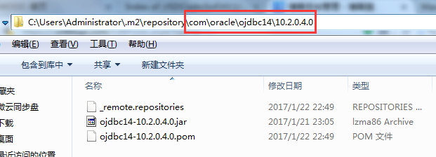

## 将下载到本地的JAR包手动添加到Maven仓库

**常用Maven仓库网址：**  
<http://mvnrepository.com/>  
<http://search.maven.org/>  
<http://repository.sonatype.org/content/groups/public/>  
<http://people.apache.org/repo/m2-snapshot-repository/>  
<http://people.apache.org/repo/m2-incubating-repository/>

### **演示添加一个 ojdbc-10.2.0.4.0.jar 的JAR包：**

**1.1 登陆<http://mvnrepository.com/> 这个地址，在搜索栏中输入你要搜索的 JAR 包的关键字：**


#### **1.2 选择你想要下载的Jar包版本：**


### 1.3 下载Jar包：


### **Maven 安装 JAR 包的命令：**

```
这里就是上图中的Jar包信息：
<!-- https://mvnrepository.com/artifact/ojdbc/ojdbc -->
<!-- (参数一)：下载到本地的ojdbc-10.2.0.4.0.jar包的真实存放路径 -->
<dependency>
    <groupId>ojdbc</groupId>-----------------(参数二)
    <artifactId>ojdbc</artifactId>-----------(参数三)
    <version>10.2.0.4.0</version>------------(参数四)
</dependency>
```


用maven命令将jar包移动到maven的本地repository中。

### 语法：

```
mvn install:install-file -Dfile=jar包的位置(参数一) -DgroupId=groupId(参数二) -DartifactId=artifactId(参数三) -Dversion=version(参数四) -Dpackaging=jar
```


 我把“ojdbc-10.2.0.4.0.jar”放到了“D:\Program Files\mvn\”下，

**注意：**“Program Files”中间**有空格**，所以要加双引号，另外三个参数，从上面复制过来即可，下面是我安装ojdbc-10.2.0.4.0.jar包使用的命令：

```
mvn install:install-file -Dfile="D:\Program Files\mvn\ojdbc-10.2.0.4.0.jar" -DgroupId=com.oracle -DartifactId=ojdbc14 -Dversion=10.2.0.4.0 -Dpackaging=jar
```


**需要注意以下几点：  
1.注意"-"不能缺少 install后面的"-"是没有空格的  
2.注意"-Dfile"中jar包的路径和jar包的名字.  
3.注意看cmd命令提示,查看本地repository中是否成功的复制了jar包.**

**重点：Jar包默认都安装在“C:\Users\Administrator\.m2\repository\”下，其实上面的(参数二，参数三，参数四)就是指定安装具体的安装路径。**

**（**以后也可以根据自己需求进行更改参数二，三，四，其实就是更改安装路径**）。**



### **ojdbc-10.2.0.4.0.jar包安装完成：**


---


作者：唐胜伟  
出处：<http://www.cnblogs.com/tangshengwei/>  
本文版权归作者和博客园共有，欢迎转载，但未经作者同意必须保留此段声明，且在文章页面明显位置给出原文连接。

---
> 参考链接：[https://www.cnblogs.com/tangshengwei/p/6341628.html](https://www.cnblogs.com/tangshengwei/p/6341628.html)
