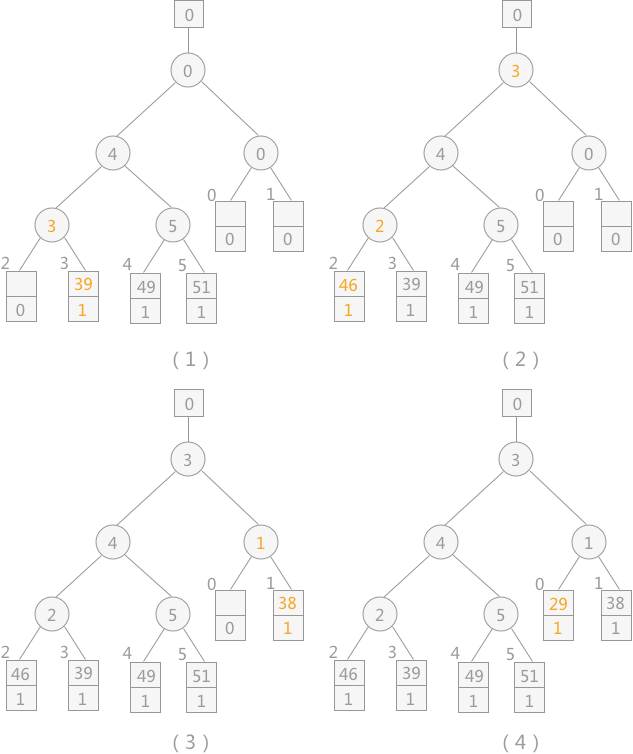
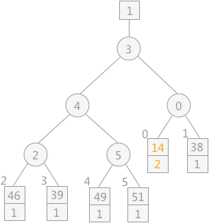

减少初始归并段的个数

1、m 的求值方法为：m = ⌈n / l⌉（n 表示为外部文件中的记录数，l 表示初始归并段中包含的记录数）

2、如果要想减小 m 的值，在外部文件总的记录数 n 值一定的情况下，只能增加每个归并段中所包含的记录数 l。而对于初始归并段的形成，就不能再采用多路平衡归并排序算法，因为所有的内部排序算法正常运行的前提是所有的记录都存在于内存中，而内存的可使用空间是一定的，如果增加 l 的值，内存是放不下的

置换 - 选择排序算法

1、例如已知初始文件中总共有 24 个记录，假设内存工作区最多可容纳 6 个记录，按照之前的选择排序算法最少也只能分为 4 个初始归并段。而如果使用置换 - 选择排序，可以实现将 24 个记录分为 3 个初始归并段，如图 1 所示：

2、置换 - 选择排序算法的具体操作过程为

（1）首先从初始文件中输入 6 个记录到内存工作区中

（2）从内存工作区中选出关键字最小的记录，将其记为 MINIMAX 记录

（3）然后将 MINIMAX 记录输出到归并段文件中

（4）此时内存工作区中还剩余 5 个记录，若初始文件不为空，则从初始文件中输入下一个记录到内存工作区中

（5）从内存工作区中的所有比 MINIMAX 值大的记录中选出值最小的关键字的记录，作为新的 MINIMAX 记录

（6）重复过程 3 - 5，直至在内存工作区中选不出新的 MINIMAX 记录为止，由此就得到了一个初始归并段

（7）重复 2 - 6，直至内存工作为空，由此就可以得到全部的初始归并段

3、以 1 例

（1）首先输入前 6 个记录到内存工作区，其中关键字最小的为 29，所以选其为 MINIMAX 记录，同时将其输出到归并段文件中，如下图所示：

（2）此时初始文件不为空，所以从中输入下一个记录 14 到内存工作区中，然后从内存工作区中的比 29 大的记录中，选择一个最小值作为新的 MINIMAX 值输出到 归并段文件中，如下图所示：

（3）初始文件还不为空，所以继续输入 61 到内存工作区中，从内存工作区中的所有关键字比 38 大的记录中，选择一个最小值作为新的 MINIMAX 值输出到归并段文件中，如下图所示：

（4）如此重复性进行，直至选不出 MINIMAX 值为止，如下图所示：

（5）当选不出 MINIMAX 值时，表示一个归并段已经生成，则开始下一个归并段的创建，创建过程同第一个归并段一样，不再赘述

4、在上述创建初始段文件的过程中，需要不断地在内存工作区中选择新的 MINIMAX 记录，即选择不小于旧的 MINIMAX 记录的最小值，此过程需要利用“败者树”来实现

（1）与多路平衡归并排序所用到的败者树不同的是，在不断选择新的 MINIMAX 记录时，为了防止新加入的关键字值小的的影响，每个叶子结点附加一个序号位

（2）当进行关键字的比较时，先比较序号，序号小的为胜者；序号相同的关键字值小的为胜者

5、在初期创建败者树时也可以通过不断调整败者树的方式，其中所有记录的序号均设为 0 ，然后从初始文件中逐个输入记录到内存工作区中，自下而上调整败者树。过程如下：

（1）创建一个空的败者树，败者树根结点上方的方框内表示的为最终的胜者所处的位置

（2）败者树根结点上方的方框内表示的为最终的胜者所处的位置，序号 1 默认为比 0 小，为败者

（3）从初始文件中读入关键字为 49 的记录，调整败者树如下图所示

（4）从初始文件依次读入关键字为 39、46、38、29 的记录，调整败者树如下图所示

（5）由败者树得知，其最终胜者为 29，设为 MINIMAX 值，将其输出到初始归并文件中，同时再读入下一个记录 14，调整败者树，如下图所示

（6）当读入新的记录时，如果其值比 MINIMAX 大，其序号则仍为 1；反之则为 2 ，比较时序号 1 比序号 2的记录大

（7）通过不断地向败者树中读入记录，会产生多个 MINIMAX，直到最终所有叶子结点中的序号都为 2，此时产生的新的 MINIMAX 值的序号 2，表明此归并段生成完成，而此新的 MINIMAX 值就是下一个归并段中的第一个记录

---
> 参考链接：[https://www.cnblogs.com/bantiaoxianyu/p/17725610.html](https://www.cnblogs.com/bantiaoxianyu/p/17725610.html)
